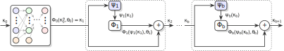

# JAX ResNet

**Acknowledgment:** This repository is a standalone Jax implementation of the deep residual neural network developed in [Online-Adaptive-Deep-Residual-Neural-Network](https://github.com/cnino98/Online-Adaptive-Deep-Residual-Neural-Network).

## Quick Start
It is assumed you use [PyEnv](https://github.com/pyenv/pyenv) and virtual environments. 

### First-Time Setup

```bash
deactivate 2>/dev/null || true
rm -rf venv
pyenv install -s 3.13.12
pyenv local 3.13.12
```
> [!IMPORTANT]
> Python 3.13.12 is the newest recommended version as more recent versions of Python may have incomplete Jax support.

### Subsequent Setup
```bash
python3 -m venv venv
source venv/bin/activate
pip install --upgrade pip
```
and then run one of the following.

#### CPU
If you want to run only on a CPU, run
```bash
pip install -e .
```

#### GPU
If a CUDA-enabled device is available, run (respectively)
```bash
pip install -e ".[cuda12]"
```
or
```bash
pip install -e ".[cuda13]"
```
> [!NOTE]
> Jax does not support Metal and thus Apple GPUs cannot be used.

## Validation with Hand Calculations
A test file validates the code against hand calculations (by Cristian Nino) of both forward and back propagation.
To see this, run the following setup in addition to the above,
```bash
pip install -e ".[test]"
```
Run the test with
```bash
python -m tests.test_resnet
```
or
```bash
pytest
```

If you are sourcing ROS 2 in your terminal emulator, try
```bash
env PYTHONPATH= pytest
```

### Reset Virtual Environment
To redo your virtual environment from scratch,
```bash
deactivate
rm -rf venv
```
then rerun first-time setup.

## Mathematical Description of the Architecture

<table>
  <tr bgcolor="white">
    <td>
      
    </td>
  </tr>
</table>

The deep residual neural network (ResNet) architecture, characterized by skip connections and hierarchical feature extraction, models incremental changes rather than complete transformations of the underlying nonlinear mapping. This architecture learns the differences (or "residuals") between input and desired output at each layer, thereby enabling effective function approximation for complex nonlinear systems without requiring explicit governing equations. A fully-connected feedforward ResNet is constructed as follows.

Let $b \in \mathbb{Z}_{\ge 0}$ be the number of building blocks, let the input be $x \in \mathbb{R}^{L_{\text{in}}}$, and let the output be $y \in \mathbb{R}^{L_{\text{out}}}$, where $L_{\text{in}}, L_{\text{out}} \in \mathbb{Z}_{\ge 1}$. For each block index $i \in \{0, \ldots, b\}$, let $k_i \in \mathbb{Z}_{\ge 1}$ denote the number of hidden layers in the $i^{\text{th}}$ block, let $\kappa_i \in \mathbb{R}^{L_{i,0}}$ denote the block input, and let $\theta_i \in \mathbb{R}^{p_i}$ denote the vector of parameters (weights and biases) associated with the $i^{\text{th}}$ block. Note that $\kappa_0 \triangleq x$ and $L_{0,0} \triangleq L_{\text{in}}$.

For all $(i,j) \in \{0, \ldots, b\} \times \{0, \ldots, k_i+1\}$, let $L_{i,j} \in \mathbb{Z}_{\ge 1}$ denote the number of neurons in the $j^{\text{th}}$ layer for the $i^{\text{th}}$ block. For all $(i,j) \in \{0, \dots, b\} \times \{0, \dots, k_i\}$, define the augmented dimension $L_{i,j}^a \triangleq L_{i,j}+1$. Each block function $\Phi_i : \mathbb{R}^{L_{i,0}^a} \times \mathbb{R}^{p_i} \to \mathbb{R}^{L_{i,k_i+1}}$ is a fully connected, feedforward deep neural network (DNN) with $L_{i,k_i+1} \triangleq L_{\text{out}}$ for all $i \in \{0, \dots, b\}$. For any input $v \in \mathbb{R}^{L_{i,j}^a}$, the DNN is defined recursively by:

$$
\varphi_{i,j}(v) \triangleq \begin{cases} 
V_{i,0}^{\top}v, & j=0, \\ 
V_{i,j}^{\top}\phi_{i,j}(\varphi_{i,j-1}(v)), & j \in \{1, \dots, k_i\} 
\end{cases}
$$

with $\Phi_i(v, \theta_i) = \varphi_{i,k_i}(v)$.

with $\Phi_i(v, \theta_i) = \varphi_{i,k_i}(v)$.

For each $j \in \{0, 1, \ldots, k_i\}$, the matrix $V_{i,j} \in \mathbb{R}^{L_{i,j}^a \times L_{i,j+1}}$ contains the weights and biases; in particular, if a layer has $n$ inputs (including the appended bias) and the subsequent layer has $m$ nodes, then $V \in \mathbb{R}^{n \times m}$ is constructed so that its $(r,c)^{\text{th}}$ entry represents the weight from the $r^{\text{th}}$ node of the input to the $c^{\text{th}}$ node of the output, with the last row corresponding to the bias terms. 

For the DNN architecture described above, the vector of DNN weights of the $i^{\text{th}}$ block is:

$$
\theta_i \triangleq \begin{bmatrix} \text{vec}(V_{i,0})^{\top} & \cdots & \text{vec}(V_{i,k_i})^{\top} \end{bmatrix}^{\top} \in \mathbb{R}^{p_i}
$$

where $p_i \triangleq \sum_{j=0}^{k_i} L_{i,j}^a L_{i,j+1}$, and $\text{vec}(V_{i,j})$ denotes the vectorization of $V_{i,j}$ performed in **column-major order** (i.e., the columns are stacked sequentially to form a vector, corresponding to `order='F'` in NumPy/JAX). 

For all $(i,j) \in \{0, \ldots, b\} \times \{0, \ldots, k_i\}$, the ensemble activation function of the $j^{\text{th}}$ layer of the $i^{\text{th}}$ block is given by $\phi_{i,j} : \mathbb{R}^{L_{i,j}} \to \mathbb{R}^{L_{i,j}^a}$, where:

$$
\phi_{i,j}(\varphi_{i,j-1}) \triangleq \begin{bmatrix} \varsigma_{i,j}((\varphi_{i,j-1})_1) \\ \varsigma_{i,j}((\varphi_{i,j-1})_2) \\ \vdots \\ \varsigma_{i,j}((\varphi_{i,j-1})_{L_{i,j}}) \\ 1 \end{bmatrix} \in \mathbb{R}^{L_{i,j}^a}
$$

where the activation function is $\varsigma_{i,j} : \mathbb{R} \to \mathbb{R}$, and $1$ accounts for the bias term.

### Residual Connections & Pre-Activation
A pre-activation design is used so that, before each block (except block $0$), the output of the previous block is processed by an external activation function. Specifically, for each block $i \in \{1, \ldots, b\}$, define the pre-activation mapping $\psi_i : \mathbb{R}^{L_{i,k_i+1}} \to \mathbb{R}^{L_{i,k_i+1}^a}$ by:

$$
\psi_i(\kappa_i) = \begin{bmatrix} \varrho_i((\kappa_i)_1) \\ \varrho_i((\kappa_i)_2) \\ \vdots \\ \varrho_i((\kappa_i)_{L_{i,k_i+1}}) \\ 1 \end{bmatrix} \in \mathbb{R}^{L_{i,k_i+1}^a}
$$

where $(\kappa_i)_\ell$ denotes the $\ell^{\text{th}}$ component of $\kappa_i$, the activation function is $\varrho_i : \mathbb{R} \to \mathbb{R}$, and $1$ accounts for the bias term. The output of $\psi_i$ serves as the input to block $i$, and the residual connection is implemented by adding the current block output to the pre-activated output from the previous block. Hence, the ResNet recursion is defined by:

$$
\kappa_{i+1} \triangleq \begin{cases} 
\Phi_0(\kappa_0^a, \theta_0), & i=0, \\ 
\kappa_i + \Phi_i(\psi_i(\kappa_i), \theta_i), & i \in \{1, \ldots, b\}, 
\end{cases}
$$

with output $y \in \mathbb{R}^{L_{\text{out}}}$ and overall parameter vector $\Theta \triangleq [\theta_0^\top, \dots, \theta_b^\top]^\top \in \mathbb{R}^{\tt p}$, with ${\tt p} \triangleq \sum_{i=0}^{b} p_i$. Here, $\kappa_0^a \triangleq [\kappa_0^\top, 1]^\top \in \mathbb{R}^{L_{0,0}^a}$ denotes the augmented input to block $i=0$. Therefore, the complete ResNet is represented as $\Psi : \mathbb{R}^{L_{\text{in}}} \times \mathbb{R}^{\tt p} \to \mathbb{R}^{L_{\text{out}}}$ expressed as:

$$
\Psi(x, \Theta) = \kappa_{b+1}
$$

## Analytical Jacobians

The partial derivative of the ResNet with respect to the parameters is represented as:

$$
\frac{\partial}{\partial\Theta}\Psi(\kappa, \Theta) = \begin{bmatrix} \frac{\partial}{\partial\theta_0}\Psi(\kappa, \Theta) & \cdots & \frac{\partial}{\partial\theta_b}\Psi(\kappa, \Theta) \end{bmatrix} \in \mathbb{R}^{L_{\text{out}} \times {\tt p}}
$$

and 

$$
\frac{\partial}{\partial\theta_i}\Psi(\kappa, \Theta) = \begin{bmatrix} \frac{\partial}{\partial{\rm vec}(V_{i,0})}\Psi(\kappa, \Theta) & \cdots & \frac{\partial}{\partial{\rm vec}(V_{i,k_i})}\Psi(\kappa, \Theta) \end{bmatrix} \in \mathbb{R}^{L_{\text{out}} \times p_i}
$$

where $\frac{\partial}{\partial{\rm vec}(V_{i,j})}\Psi(\kappa, \Theta) \in \mathbb{R}^{L_{\text{out}} \times L_{i,j}^a L_{i,j+1}}$ for all $j \in \{0, \ldots, k_i\}$. Using the architecture definitions and the property of the vectorization operator yields:

$$
\frac{\partial\Psi}{\partial\mathrm{vec}(V_{i,j})} = \left(\stackrel{\curvearrowleft}{\prod_{m=i+1}^{b}} \left(I_{L_{\text{out}}} + \left(\stackrel{\curvearrowleft}{\prod_{\ell=1}^{k_m}} V_{m,\ell}^{\top}\frac{\partial\phi_{m,\ell}}{\partial\varphi_{m,\ell-1}}\right)V_{m,0}^{\top}\frac{\partial\psi_m}{\partial\kappa_m}\right)\right) \cdot \left(\stackrel{\curvearrowleft}{\prod_{\ell=j+1}^{k_i}} V_{i,\ell}^{\top}\frac{\partial\phi_{i,\ell}}{\partial\varphi_{i,\ell-1}}\right)\left(I_{L_{i,j+1}} \otimes \varkappa_{i,j}^{\top}\right)
$$

where $\varkappa_{i,j}$ is defined as:
* $\kappa_0^a$ if $i=0$ and $j=0$
* $\phi_{0,j}(\varphi_{0,j-1}(\kappa_0^a))$ if $i=0$ and $j>0$
* $\psi_i(\kappa_i)$ if $i>0$ and $j=0$
* $\phi_{i,j}(\varphi_{i,j-1}(\psi_i(\kappa_i)))$ if $i>0$ and $j>0$

The Jacobian $\frac{\partial\phi_{i,j}(\varphi_{i,j-1}(v))}{\partial\varphi_{i,j-1}(v)} : \mathbb{R}^{L_{i,j}} \to \mathbb{R}^{L_{i,j}^a \times L_{i,j}}$ of the activation function vector at the $j^{\text{th}}$ layer is given by:

$$
\frac{\partial\phi_{i,j}(\varphi_{i,j-1}(v))}{\partial\varphi_{i,j-1}(v)} = \begin{bmatrix} \text{diag}\left( \frac{{\rm d}\varsigma_{i,1}((\varphi_{i,j-1})_1)}{{\rm d}(\varphi_{i,j-1})_1}, \ldots, \frac{{\rm d}\varsigma_{i,L_{i,j}}((\varphi_{i,j-1})_{L_{i,j}})}{{\rm d}(\varphi_{i,j-1})_{L_{i,j}}} \right) \\ \mathbf{0}_{L_{i,j}}^{\top} \end{bmatrix}
$$

Similarly, the Jacobian $\frac{\partial\psi_m(\kappa_m)}{\partial\kappa_m} : \mathbb{R}^{L_{\text{out}}} \to \mathbb{R}^{L_{\text{out}}^a \times L_{\text{out}}}$ of the pre-activation function vector at block $m$ is given by:

$$
\frac{\partial\psi_m(\kappa_m)}{\partial\kappa_m} = \begin{bmatrix} \text{diag}\left( \frac{{\rm d}\varrho_{m,1}((\kappa_m)_1)}{{\rm d}(\kappa_m)_1}, \ldots, \frac{{\rm d}\varrho_{m,L_{\text{out}}}((\kappa_m)_{L_{\text{out}}})}{{\rm d}(\kappa_m)_{L_{\text{out}}}} \right) \\ \mathbf{0}_{L_{\text{out}}}^{\top} \end{bmatrix}
$$